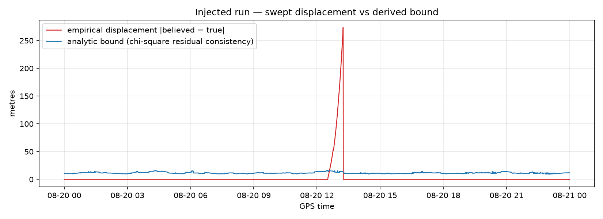
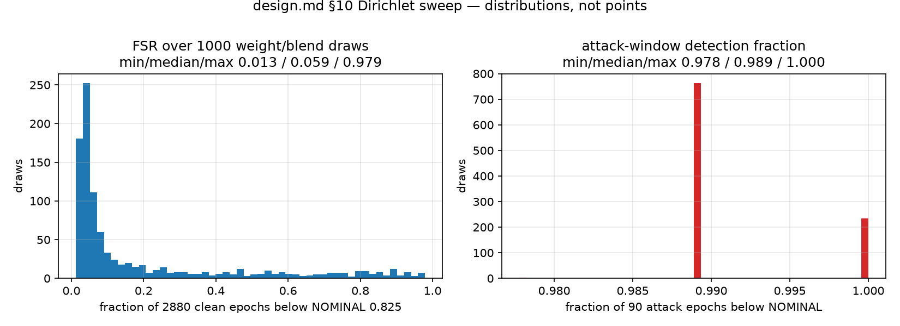

# ARBITER

**A**uthenticated **R**anging, **B**ounded **I**ntegrity, **T**iered **E**xecution **R**ights.

Spoof detection is solved. What happens in the ninety seconds after detection
is not.

ARBITER sits between a GNSS receiver and an autonomy stack and continuously
scores positional trust, then degrades the vehicle's authority in stages —
full autonomy, coast on inertial, finish the leg, hold position — rather than
making one binary trust decision.

**Signal quality is not provenance.**

Built at DNHacks, 5-6 September 2026.

## Run it
    bash bootstrap.sh          # python 3.12 venv + libraries + data (~10 min)
    source .venv/bin/activate
    python -m backend.demo && python -m console.server   # then open the console

## Results

Real observables: USN8 (US Naval Observatory), 2026-08-20, 2,880 epochs at
30 s, five constellations. Attack: measurement-domain carry-off injected on
the six highest-elevation GPS satellites, 1 m/s walk-off, onset 12:30.
Detector weights equal (flagged untuned), feature/geometry blend β = 0.5,
thresholds as derived below. The two §10 numbers:

**Integrity — maximum adversarial displacement: 3.67 m** (believed vs true
position at the epoch immediately preceding the first transition out of
NOMINAL), against an **analytic bound of 14.0 m** computed from the same
epoch's trusted geometry. The bound's only empirical input is σ_UERE =
1.934 m, the measured clean-day post-fit residual RMS. The explicit §10
check was run: empirical ≤ bound at **2,709 of 2,709** epochs whose
arbitrated state was NOMINAL — the bound claims nothing once the system has
flagged, and it was never beaten while the system still trusted the signal
(`python -m backend.measurement.displacement out/carryoff.jsonl`).

**Continuity — false surrender rate: 0.0000** (0 of 2,880 clean epochs below
NOMINAL through the arbiter, hysteresis included). Reported per convention as
a distribution over 1,000 Dirichlet draws of the four feature weights and the
feature/geometry blend, never a point: raw-confidence FSR min/median/max
**0.000 / 0.000 / 0.282**; arbitrated FSR median **0.0000**, max 0.460 in the
extreme-blend tail. Attack-window detection fraction min/median/max
0.000 / 0.944 / 0.989 — the min is the β→0 (geometry-only) corner, where the
per-SV exclusion rule alone does not push confidence under NOMINAL.
**44.6% of epochs are weight-sensitive** under this deliberately hostile draw
(β swept over the full unit interval); at the shipped weights the verdict
sits in the robust mass of both histograms.

Supporting numbers: time-to-alert 4 epochs (2 min at the 30 s cadence) from
onset to first downgrade; the injector reached 273.5 m of displacement at
2,660 m of range offset — after the system had already surrendered. The
demo replay traverses NOMINAL → DEGRADED → RESTRICTED → SURRENDERED on
signal alone, recovers up the staircase when the attack stops, then drops to
SURRENDERED by credential force when the TESLA chain lapses under a clean
sky (`python -m console.replay out/demo.jsonl`).

The geometry half behaves as derived, on real data:

- Normalised information ratio over the clean day: 0.887–0.938, no
  exclusions ([plot](docs/plots/information_ratio_clean_day.png)).
- The raw determinant ratio decays exponentially with exclusions while the
  normalised (D-optimality) form stays legible; dropping all of Galileo
  reads 0.653, not 0.00
  ([plot](docs/plots/det_ratio_raw_vs_normalised.png)).
- Freeze-at-last-NOMINAL costs almost nothing: frozen-vs-live ratio gap
  0.0007 at 30 min, ≤ 0.015 over a 2 h freeze
  ([plot](docs/plots/freeze_divergence.png)).

## Course correction (Track D) — weighted RAIM, by name

After exclusion the system does not stop at "don't trust it" — it re-solves
position on the trusted subset, bounds how wrong that fix could be, and
gates driving on it. This is RAIM fault exclusion plus a protection level,
ported from aviation, not invented: `PL = τ · max_i ||S[0:3,i]|| / √P_ii`
(single-fault weighted-RAIM slope), evaluated on the corrected solution.
`d_rho` has the broadcast satellite clock removed; iono/tropo are ignored
as near common-mode at one site — the clean-day residual floor absorbs
them, and the thresholds are fit on that floor rather than assuming it
away.

Clean-day check (the go/no-go for shipping a corrected fix): the corrected
position sits on the antenna **horizontally at 0.95 m median, 3.97 m max**
over all 2,880 epochs; the 3D error (median 15.2 m) is the unmodelled
single-frequency vertical atmospheric bias
([plot](docs/plots/correction_clean_day_error.png)). Clean-day PL: median
3.51 m, max 6.67 m against the 15 m alert limit — small and stable
([plot](docs/plots/correction_clean_day_pl.png)). Gate availability on the
clean day: 0.9816 (three chi-square tail revokes, each costing the
10-epoch re-grant — the predicted ~3/day at the p99.9 fit).

Under attack, the explicit §10-style check was run: **zero epochs in all
four scenarios** where `correction_ok` was true while the attack-induced
displacement of the corrected fix exceeded PL
([plot](docs/plots/correction_displacement_vs_pl.png)). The carry-off
revokes one epoch after onset; believed, corrected and `_truth` tracks are
on one axis in
[the scenario plot](docs/plots/correction_carry_off_positions.png). Two
findings worth stating plainly: uniform-offset attacks (simplistic,
meaconing) displace the corrected position by 0.000 m — the constellation
clock states absorb a common bias exactly, so the gate correctly does not
revoke for them; and 14 clean epochs show fault-free error above PL,
because the single-fault slope bound carries no nominal-noise term
(aviation adds K·σ) — a documented limitation, not an integrity violation.

Correction thresholds, same by-hand procedure as below, fit on the clean
day only (`python -m backend.correction.validate`): **τ = 5.187 m** (p99.9
of 49,287 per-SV post-fit residuals), **chi-square cutoff = 7.703 m²**
(p99.9 of the per-epoch r'Wr/dof statistic), **DR drift bound = 20.672 m**
(p99.9 of the clean 3D corrected-fix error; on the replay dead reckoning
is "still at the antenna", so the bound is the measured noise floor).

## Roadmap: terrain channel (Track E) — SIMULATED sensor, off by default

A fifth evidence channel that does not enter through the antenna: a small
terrain-class sensor, checked against a signed pre-map at the position the
receiver believes it holds. Scoped from a conversation with Mach Industries,
who are building the sensor; **we have no such sensor, so everything below is
a confusion-matrix simulation on a real map**, stamped `sensor.source:
"simulated"` in every record, off unless `python -m backend.demo
--terrain-map` is given, and deliberately absent from the submission video
(design.md §11b). Scope, derivations and the build record are in
`tracks/TRACK_E.md`; the code is `backend/terrain/`.

On the CASEVAC mission stream the channel is on (`backend/missions.py`,
confusion diagonal 0.85 stated) and the console renders it: a fifth feature
bar labelled `terrain · sim`, the displacement bound's source with the
non-binding bound beside it, and a `Terrain · simulated` cell — sensed class
at the receiver, map class at the believed fix, match likelihood, the next
boundary as a testable prediction, gate check 6 on the signed map — each value
tooltipped with its contract path. With the trust layer off the block leaves
the wire with everything else the layer produces.

**What it adds, additively.** A fifth feature `terrain_mismatch` (1 − L/L_max
between the sensor posterior and the map posterior under the fix's HDOP
footprint), a `terrain` block, a map-derived displacement bound combined with
the residual bound by `min` (`geometry.bound_source` names which one binds),
a terrain next-best observation for `DEGRADED` ("if the reported position is
right, the sensor should read *paved* 8 m to the west-south-west"), and a
sixth correction-gate check. A sensorless run is unchanged apart from the
additive `score_detail.features_scored` list.

**The map is real.** OpenStreetMap features within 600 m of the antenna,
rasterised at 5 m (7 classes, data © OpenStreetMap contributors,
ODbL), Ed25519-signed at load, checksum `bbd4ef76977c`. WorldCover / NLCD
(the spec's first choice) have no reader in this environment. The antenna cell
is *building*; **37.7% of cells are unlabelled** and are treated
conservatively (no weight in the footprint, absorbed by the extent, never a
boundary). From the antenna the nearest class boundary is
7.9 m away and the ray-march boundary distance on the
eight sweep bearings is 12.5–72.5 m, so at the §7 walk rate of 1 m/s the channel's
predicted first fire is 1.4–3.4 epochs
([polar plot](docs/plots/terrain_tta_polar.png), [map with the measured
believed track](docs/plots/terrain_map.png)).

**Measured on the shipped streams, by rescoring** (`python -m
backend.terrain.validate --map data/terrain_usn8.npz`; the feature, block and
composite are pure functions of position, HDOP, map and sensor draw, so no
solver re-run): the carry-off walks the believed position east on bearing
~80°, and the channel first fires at **attack epoch
3, at 31 m of displacement** (predicted
1.7 on the 90° ray). Every figure is a curve over the simulated
sensor's confusion diagonal, never a point, with W = 1 (no smoothing, untuned)
unless stated:

| confusion diagonal | clean-day fire rate (feature ≥ 0.5) | attack fire rate, scored epochs | d′ W=1 | d′ W=4 | first fire (attack epoch) |
|---|---|---|---|---|---|
| 0.60 | 0.403 | 0.885 | 1.16 | 1.98 | 2 |
| 0.70 | 0.296 | 0.923 | 1.67 | 2.35 | 2 |
| 0.80 | 0.193 | 0.904 | 2.00 | 3.25 | 2 |
| 0.90 | 0.094 | 0.846 | 2.36 | 2.94 | 2 |
| 0.95 | 0.046 | 0.885 | 3.23 | 2.74 | 2 |
| 0.99 | 0.011 | 0.885 | 3.88 | 4.59 | 2 |

The clean-day fire rate at W = 1 is the misread rate, as derived (a misread
reads 1 − off-diagonal/diagonal ≈ 0.97). The attack fire rate is over the
**58% of attack epochs the channel could score at all** — the walk
leaves the 600 m map window and crosses unlabelled cells for the rest, and on
those epochs the channel makes no claim rather than repeating its last verdict.
It also passes over a second building at ~500 m east, where *building* reads as
*building*: the class-collision blind spot the scope predicted, visible in
[the timeline](docs/plots/terrain_carryoff.png). Full sweep:
[sensor quality](docs/plots/terrain_sensor_quality.png).

**Three honest results.** (1) **The map-derived bound never binds here**: the
class-consistent extent at the antenna is 268 m, because the extent absorbs
unlabelled cells and 38% of this raster is unlabelled, against a residual
bound of 10–16 m; `bound_source` reads `residual` on every epoch. Map
completeness, not sensor quality, is what would tighten it. (2) **At equal
untuned weights over five features, a saturated terrain feature moves
confidence by at most 0.1** (weight 0.2 × β 0.5); its weight is a threshold-
session decision, which is what d′ is for. (3) **Gate check 6 stays true
through the attack** (2,879 of 2,880 carry-off epochs, one not evaluated) —
correctly: Track D's corrected fix sits on the antenna, where the sensor
agrees, while the *believed* fix disagrees. That pairing is the signature of a
successful correction. With a single-epoch likelihood and a symmetric
confusion sensor the check can never read false, though (floor = p0.1 of L
sits at the misread level); a windowed check is the next iteration.

**A pre-existing state this exposed, unrelated to terrain:** the shipped
`out/*.jsonl` (regenerated 21:08 today) carry `pseudorange_residual = 0.0` on
every epoch — `backend/demo.py` scores features without the post-fit residual
panel that `backend/replay.py` supplies — so no satellite is ever excluded,
the arbiter stays NOMINAL through the carry-off, and the §10 check reads
**2,792 / 2,880** against the residual bound with or without the terrain
channel. The results section above predates those streams. Terrain neither
causes nor fixes this; the terrain pipeline inherits it.

## Missions (Track F) — one arbiter, four theatres

`python -m console.server` now opens a routing page at `/`: a hero that
says what ARBITER is (every headline number computed from the streams on
disk at server start, with its source), a four-way mission selector whose
tiles render each mission's own environment from one WebGL renderer, and
the console itself at `/console?mission=<name>` in the third section.
Scope, decisions and measured numbers: `tracks/TRACK_F.md` and the four
`tracks/TRACK_F_<MISSION>.md` files.

| Mission | Attack (design.md §7) | Correction | Measured on the stream |
|---|---|---|---|
| **LOGISTICS** | Intermediate carry-off, cross-corridor, six GPS SVs, 0.2 m/s | **Operator takeover** without a trusted fix: corridor breach withdraws autonomy, a person drives the convoy (keyboard / gamepad / touch; a scripted stand-in when nobody is at the controls, labelled), hand-back at DEGRADED | DEGRADED 65, SURRENDERED 67, staircase 180/190/200, credential lapse 390 |
| **RECON** | Repeater at a 300 m standoff re-radiating all GPS (offset meaconing) | **Automatic, stationary deduction**: GPS is the odd constellation out and is dropped wholesale; the scout keeps a Galileo fix; at an observation point the drag of the believed fix while stationary is the spoof and points at the emitter | 12 GPS out at onset, information ratio 0.80, Galileo fix within 1 m with PL 7.4 m while the believed fix is 118 m out; stationary deduction: anchor agrees with the Galileo fix to 0.46 m median, emitter bearing 85° (90° injected), path delay 259 m (300 m injected); nothing excluded once the repeater stops |
| **CASEVAC** | Carrier-coherent carry-off along the route toward the collection point | **Automatic, terrain-referenced**: Track E's signed pre-map and simulated class sensor; each class boundary the sensor crosses pins arc length along the known route | SURRENDERED 62 (code−carrier blind, residual + geometry catch it), staircase 150/160/170; terrain fix: 7 boundary pins, fix error 2.25 m median after the first pin, believed pin claims the CCP at 84, terrain confirms arrival at 264 (0.5 m); sensor SIMULATED |
| **COMBAT** | Crude 15 dB step on all GPS, 250 m commanded (98 m achieved: Galileo anchors the joint fix) | **Operator takeover on the corrected fix**: autonomy withdrawn (three features saturate), the operator drives on the Galileo fix ARBITER stands behind; fire-control input marked conditional | SURRENDERED 60 (two states skipped), 12 GPS out, PL 7.4 m, staircase 86/96/106 |

Every mission stream is real USN8 observables with the attack injected in
the measurement domain: `python -m backend.missions --mission all`
regenerates `out/<name>.jsonl` and `docs/stream_provenance_<name>.md`.
The route, props, motion, halts and environments are a presentation frame
under the measured displacement; the receiver never moved.

Two mechanisms landed on the way and apply to everything above:

- **Feature 2 was unscored in every demo stream** (`backend/demo.py`
  never fed the post-fit residual to the extractor; fixed 2026-09-05
  late). The regenerated demo now transitions on signal at epoch 61/62.
  The shipped thresholds pre-date that change: clean-day FSR at 0.643 is
  now 0.041 (5 events), and a crude attack saturating three features
  reads 0.49 at onset even while the derived half stands behind a valid
  fix. The §10 threshold session has to be redone on the wired pipeline.
- **Constellation-first exclusion** (`backend/missions.py`): when the
  cross-constellation feature is saturated and both channels touching one
  constellation are beyond their clean-day scale while the third is inside
  half of it, that constellation is excluded and nothing else (0 fires on
  2,880 clean epochs). The per-SV residual rule cascades onto authentic
  satellites under a subset carry-off (LOGISTICS, CASEVAC): detection, not
  fault isolation — RAIM exclusion by solution separation is the roadmap.

Environments are modules (`console/web/env/`, contract in `CONTRACT.md`,
preview at `/env/preview.html?env=<name>`), rendered, never imagery; assets
are Poly Haven CC0, fetched by `bootstrap.sh`. Headless screenshots must be
judged with `?post=0&shadow=0&envmap=0` (software GL renders the composer
and float environment maps near-black).

## How the thresholds were set

By hand, from distributions, per design.md §10 — never a round number
without a reason.

1. Clean day through the detector: 2,880 confidence values —
   min 0.6591, p1 0.7315, median 0.8679.
2. Attack window (the injector's own 90-epoch truth log): p95 0.6268,
   p75 0.5478, median 0.5338, p25 0.5182. Separation d′ = 7.18.
3. The only overlap is the attack's first ~4 ramp epochs (range offset
   ≤ 110 m, position displacement ≤ ~7 m) against clean's deepest tail —
   those epochs set time-to-alert, not the threshold.
4. **NOMINAL = 0.643**, the midpoint of the zero-overlap band
   [attack p95 0.6268, clean min 0.6591]: zero clean epochs below it,
   ≥ 95% of attack epochs under it.
5. **DEGRADED = 0.548 (attack p75)** and **RESTRICTED = 0.518 (attack
   p25)** — deliberately raised *into* the attack distribution so the
   state machine traverses the full staircase on signal alone and the
   deep-attack quartile reads SURRENDERED.

The provenance string is stamped into every emitted decision
(`console/arbiter/states.py` is the single swap point). The Dirichlet sweep
above is the answer to "you picked the weights that make this work":
arXiv 2607.05415 showed composite PNT scores flip winners in up to 22% of
re-weighting draws; we report the whole distribution and the exact fraction
of epochs where weighting decides.

## Prior art, named honestly

- **PNTTING** (DHS S&T / MITRE, Molina-Markham et al.) — closest published
  work: probabilistic trust inference for PNT user equipment. More
  principled than ours; no credential binding, no authority arbiter with a
  published false-alarm rate.
- **DHS Resilient PNT Conformance Framework v2.0** (2022) and **Reference
  Architecture v1.0** — our state machine instantiates their behavioural
  intent; "function under the assumption of compromise" is the doctrinal
  parent. **IEEE P1952** is the standard in development; our instrument is
  a candidate conformance test.
- **RAIM / ARAIM** — the closest published relative of the geometry score's
  subset reasoning; independent-fault model, not a coordinated adversary.
  Our course-correction track (tracks/TRACK_D.md, `backend/correction/`)
  is weighted RAIM by name: slope-form protection level, fault exclusion
  via trust weights, alert limit as the actionability gate.
- **Chen, Dai, Adang, Gao, Schwager — CONVERGE (Stanford)** — Fisher
  Information Gain reduced to a tractable surrogate for active view
  selection. Different domain, same mathematics: the rank-one determinant
  identity behind `geometry.next_best_observation` is theirs.
- **arXiv 2607.05415** (June 2026) — the weighting-instability result the
  Dirichlet sweep answers. Ally and challenge.
- **Galileo OSNMA** (operational July 2025) / **ICAO Doc 10169** — the
  TESLA-based protocols our credential layer reimplements at toy scale.
- **Rothmaier, Chen, Lo, Walter (ION GNSS+ 2021)**; **Psiaki & Humphreys
  (Proc. IEEE 2016)**; **TEXBAT / OAKBAT**; **Shepard, Humphreys, Fansler
  (2012)** — the detection lineage; our detector is that class of method.

## Limitations

Stated properly, not softened:

1. **The attack is synthetic.** Our injector writes the carry-off into real
   RINEX observables; absolute detection numbers are not comparable to
   signal-domain results on TEXBAT. The analytic bound is the defence
   against "your injector was easy": it does not depend on which attacks we
   had time to run.
2. **One station, one day, one injector, static, open sky.** Thresholds are
   measured separation points for USN8/2026-08-20 and generalise no further
   than that sentence.
3. **The geometry score's line-of-sight vectors derive from the receiver's
   own position estimate** — under attack, the spoofed one. Below NOMINAL
   they are frozen at the last trusted epoch: the dependency is bounded
   (divergence ≤ 0.015 over 2 h, logged as evidence), not eliminated.
4. **TESLA depends on loose time sync, and time comes from the receiver
   under attack.** Bounded by the clock-coupling invariant (below NOMINAL
   the clock free-runs and new credentials are not accepted), not
   eliminated. The credential channel is also a DoS surface; interval
   length and disclosure lag are venue-tuned operational parameters.
5. **The displacement bound assumes trusted-subset residual consistency is
   the only constraint on the attacker.** A spoofer with a better
   propagation model attacks the calibration, not the residuals.
6. **The feature half is a weighted sum** and single-number scores are
   weighting-sensitive — hence the distribution, and the honest 44.6%
   weight-sensitive fraction under a full-unit-interval blend sweep. The
   geometry half is weight-free; β = 0.5 of the composite is covered by it.
7. **GLONASS is excluded from the H matrix** (state-vector ephemeris, not
   Keplerian; propagating it didn't fit the build) — it still contributes
   to the feature half. Which constellations entered H is recorded per
   epoch.
8. **Two position solvers coexist** (absolute per-constellation WLS feeding
   the cross-constellation feature; differential WLS feeding the displayed
   displacement and σ_UERE). Layering is documented in
   `docs/stream_provenance.md`; it is a seam, and seams are where bugs
   live.
9. **No live OSNMA verification; anchor distribution assumed.**
10. **The corrected fix is only as good as the exclusion.** A
    self-consistent majority spoof passes the residual test; only the
    continuity and cross-constellation checks stand in the way, and
    continuity on this replay is trivially satisfied by a static receiver.
11. **Single-fault PL is a lower bound on multi-fault exposure** (PL_k for
    k simultaneous faults is emitted alongside: median 15.4 m at k=6 under
    the carry-off), and it carries no nominal-noise term — 14 clean epochs
    show fault-free error above PL.
12. **Acting on the corrected fix inside the alert limit is a policy
    choice made explicit, not a proof that acting is safe.** It is the
    same choice aviation makes with RAIM.
13. **26 hours.**
14. **The terrain sensor is simulated.** Every Track E figure is conditional
    on a confusion matrix nobody has measured, and is reported as a curve
    over it. Class-based terrain evidence is bounded by boundary density and
    map completeness: on this raster 38% of cells are unlabelled and the
    map-derived bound never binds. The bound holds against a map-aware
    spoofer; the time-to-alert does not. The map is a supply-chain surface,
    signed here by the same machine that verifies it.
15. **The terrain channel goes quiet exactly where an attacker would take
    it** — off the map, onto unlabelled ground, or onto another cell of the
    same class. A sustained "no claim" inside the mission area is itself
    evidence and is not yet consumed as such.
16. **Gate check 6 is degenerate at W = 1** for a symmetric confusion sensor
    (its floor sits at the misread level), and a static receiver yields one
    terrain observation forever: the trajectory form of the channel is
    untested.

## Philosophy

The Stoics distinguish the impression (*phantasia*) from the assent
(*sunkatathesis*). A spoofed vehicle's error is not in perceiving — the
spoofed signal is genuinely there — but in assenting to it. ARBITER is a
discipline of assent: perception continues under attack; authority is what
gets withdrawn. (Epictetus, tr. Carter 1758; Marcus Aurelius, tr. Long
1877 — both public domain.)

## Read first
- `CLAUDE.md` — working agreement and hard constraints
- `docs/design.md` — the authoritative technical document
- `docs/stream_provenance.md` — what is measured, what is injected, what is
  scripted, per stream field
- `tracks/TRACK_{A,B,C,D,E}.md` — per-person work packets (D is the
  weighted-RAIM course-correction track, built as `backend/correction/`;
  E is the simulated terrain channel, built as `backend/terrain/`)
